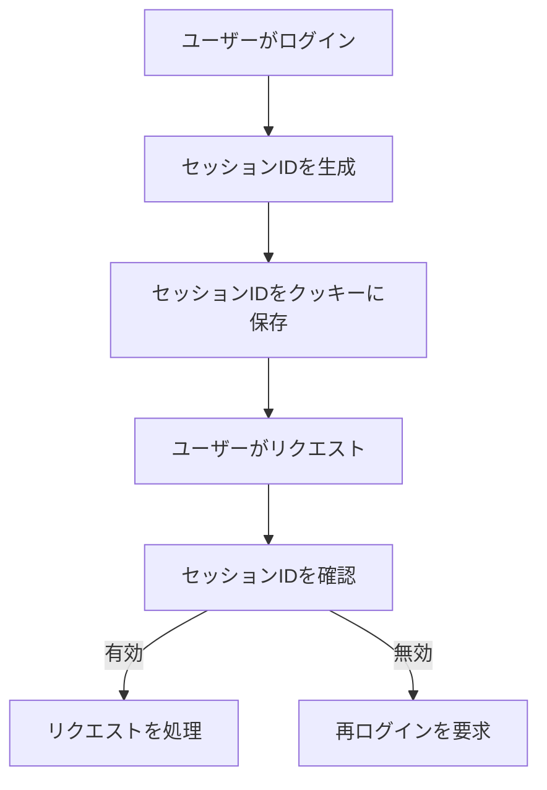

# セッション管理
セッション管理は、ユーザーのログイン状態を維持し、セキュリティを確保するための仕組みです。これにより、ユーザーがアプリケーションを利用する際に、再度ログインすることなく、連続してサービスを利用できるようになります。

## 概要
セッション管理は、ユーザーの認証情報を保持し、セッションの有効期限を管理する機能です。これにより、ユーザーがアプリケーションを利用する際の利便性を向上させるとともに、セキュリティリスクを軽減します。

## なぜ重要か
セッション管理は、ユーザーエクスペリエンスを向上させるだけでなく、セキュリティの観点からも重要です。適切なセッション管理が行われないと、ユーザーの情報が不正にアクセスされる危険性があります。特に、セッションハイジャックや不正ログインなどの攻撃からユーザーを守るためには、強固なセッション管理が不可欠です。

## 仕組みと基本の流れ
セッション管理は、ユーザーがログインした際にセッションIDを生成し、それをクッキーに保存します。以降のリクエストでは、このセッションIDを用いてユーザーを特定します。セッションの有効期限が切れると、再度ログインを要求します。

1. ユーザーがログインすると、セッションIDが生成される。
2. セッションIDはクッキーに保存され、ブラウザに送信される。
3. ユーザーがリクエストを送信するたびに、セッションIDがサーバーに送信され、ユーザーが認証される。
4. セッションの有効期限が切れた場合、再ログインが必要となる。

## 仕様・特徴（詳細）
### データ・状態・ルール
- **セッションID**: ユーザーを一意に識別するためのトークン。
- **リフレッシュトークン**: セッションを延長するためのトークン。
- **セッションの有効期限**: セッションIDは30分、リフレッシュトークンは400日間有効。

### フローとアルゴリズム（必要なら Mermaid 図）

### 例外・コーナーケース・既知の落とし穴
- **セッションの盗用**: セッションIDが漏洩すると、他のユーザーが不正にアクセスできる。
- **リフレッシュトークンの不正使用**: リフレッシュトークンが盗まれると、長期間にわたって不正アクセスが可能になる。

### 制約・前提・非機能要件
- セッションIDは、セキュアな方法で生成され、保存される必要があります。
- セッションの有効期限は、適切に設定され、定期的に更新される必要があります。

## 利用シナリオ（ユーザー視点）
ユーザーがアプリケーションにログインすると、セッションが開始され、ユーザーはログイン状態を維持したまま、他のページに移動できます。セッションが切れると、再度ログインを求められます。

## 運用のヒント / ベストプラクティス（bad knowhow 可）
- セッションの有効期限を短く設定し、定期的に更新することでセキュリティを強化します。
- セッションIDをHTTPS経由でのみ送信し、クッキーにセキュア属性を設定します。

## 用語集（本文と対応づけて）
- **セッションID**: ユーザーを識別するための一意のトークン。
- **リフレッシュトークン**: セッションを延長するためのトークン。
- **クッキー**: ブラウザに保存される小さなデータ。

## 関連ファイル
- [src/common/session/cookie.rs](https://github.com/netmateapp/netmate-api/tree/main/src/common/session/cookie.rs)
- [src/common/session/mod.rs](https://github.com/netmateapp/netmate-api/tree/main/src/common/session/mod.rs)
- [src/common/session/refresh_pair_expiration.rs](https://github.com/netmateapp/netmate-api/tree/main/src/common/session/refresh_pair_expiration.rs)
- [src/common/session/refresh_token.rs](https://github.com/netmateapp/netmate-api/tree/main/src/common/session/refresh_token.rs)
- [src/common/session/session_expiration.rs](https://github.com/netmateapp/netmate-api/tree/main/src/common/session/session_expiration.rs)
- [src/common/session/session_id.rs](https://github.com/netmateapp/netmate-api/tree/main/src/common/session/session_id.rs)
- [src/common/session/session_series.rs](https://github.com/netmateapp/netmate-api/tree/main/src/common/session/session_series.rs)
- [src/middlewares/manage_session/dsl/authenticate.rs](https://github.com/netmateapp/netmate-api/tree/main/src/middlewares/manage_session/dsl/authenticate.rs)
- [src/middlewares/manage_session/dsl/extract_session_info.rs](https://github.com/netmateapp/netmate-api/tree/main/src/middlewares/manage_session/dsl/extract_session_info.rs)
- [src/middlewares/manage_session/dsl/manage_session.rs](https://github.com/netmateapp/netmate-api/tree/main/src/middlewares/manage_session/dsl/manage_session.rs)
- [src/middlewares/manage_session/dsl/mitigate_session_theft.rs](https://github.com/netmateapp/netmate-api/tree/main/src/middlewares/manage_session/dsl/mitigate_session_theft.rs)
- [src/middlewares/manage_session/dsl/reauthenticate.rs](https://github.com/netmateapp/netmate-api/tree/main/src/middlewares/manage_session/dsl/reauthenticate.rs)
- [src/middlewares/manage_session/dsl/refresh_session_series.rs](https://github.com/netmateapp/netmate-api/tree/main/src/middlewares/manage_session/dsl/refresh_session_series.rs)
- [src/middlewares/manage_session/dsl/update_refresh_token.rs](https://github.com/netmateapp/netmate-api/tree/main/src/middlewares/manage_session/dsl/update_refresh_token.rs)
- [src/middlewares/manage_session/dsl/update_session.rs](https://github.com/netmateapp/netmate-api/tree/main/src/middlewares/manage_session/dsl/update_session.rs)
- [src/middlewares/manage_session/interpreter/authenticate.rs](https://github.com/netmateapp/netmate-api/tree/main/src/middlewares/manage_session/interpreter/authenticate.rs)
- [src/middlewares/manage_session/interpreter/mitigate_session_theft.rs](https://github.com/netmateapp/netmate-api/tree/main/src/middlewares/manage_session/interpreter/mitigate_session_theft.rs)
- [src/middlewares/manage_session/interpreter/reauthenticate.rs](https://github.com/netmateapp/netmate-api/tree/main/src/middlewares/manage_session/interpreter/reauthenticate.rs)
- [src/middlewares/manage_session/interpreter/refresh_session_series.rs](https://github.com/netmateapp/netmate-api/tree/main/src/middlewares/manage_session/interpreter/refresh_session_series.rs)
- [src/middlewares/manage_session/interpreter/update_refresh_token.rs](https://github.com/netmateapp/netmate-api/tree/main/src/middlewares/manage_session/interpreter/update_refresh_token.rs)
- [src/middlewares/manage_session/interpreter/update_session.rs](https://github.com/netmateapp/netmate-api/tree/main/src/middlewares/manage_session/interpreter/update_session.rs)
- [src/middlewares/start_session/dsl/assign_refresh_pair.rs](https://github.com/netmateapp/netmate-api/tree/main/src/middlewares/start_session/dsl/assign_refresh_pair.rs)
- [src/middlewares/start_session/dsl/assign_session_id.rs](https://github.com/netmateapp/netmate-api/tree/main/src/middlewares/start_session/dsl/assign_session_id.rs)
- [src/middlewares/start_session/dsl/start_session.rs](https://github.com/netmateapp/netmate-api/tree/main/src/middlewares/start_session/dsl/start_session.rs)
- [src/middlewares/start_session/interpreter/assign_refresh_pair.rs](https://github.com/netmateapp/netmate-api/tree/main/src/middlewares/start_session/interpreter/assign_refresh_pair.rs)
- [src/middlewares/start_session/interpreter/assign_session_id.rs](https://github.com/netmateapp/netmate-api/tree/main/src/middlewares/start_session/interpreter/assign_session_id.rs)

## 根拠注釈
- [1]: [src/common/session/cookie.rs](https://github.com/netmateapp/netmate-api/tree/main/src/common/session/cookie.rs)
- [2]: [src/common/session/refresh_pair_expiration.rs](https://github.com/netmateapp/netmate-api/tree/main/src/common/session/refresh_pair_expiration.rs)
- [3]: [src/common/session/session_expiration.rs](https://github.com/netmateapp/netmate-api/tree/main/src/common/session/session_expiration.rs)
- [4]: [src/common/session/session_id.rs](https://github.com/netmateapp/netmate-api/tree/main/src/common/session/session_id.rs)
- [5]: [src/common/session/session_series.rs](https://github.com/netmateapp/netmate-api/tree/main/src/common/session/session_series.rs)
- [6]: [src/middlewares/manage_session/dsl/manage_session.rs](https://github.com/netmateapp/netmate-api/tree/main/src/middlewares/manage_session/dsl/manage_session.rs)
- [7]: [src/middlewares/manage_session/dsl/mitigate_session_theft.rs](https://github.com/netmateapp/netmate-api/tree/main/src/middlewares/manage_session/dsl/mitigate_session_theft.rs)