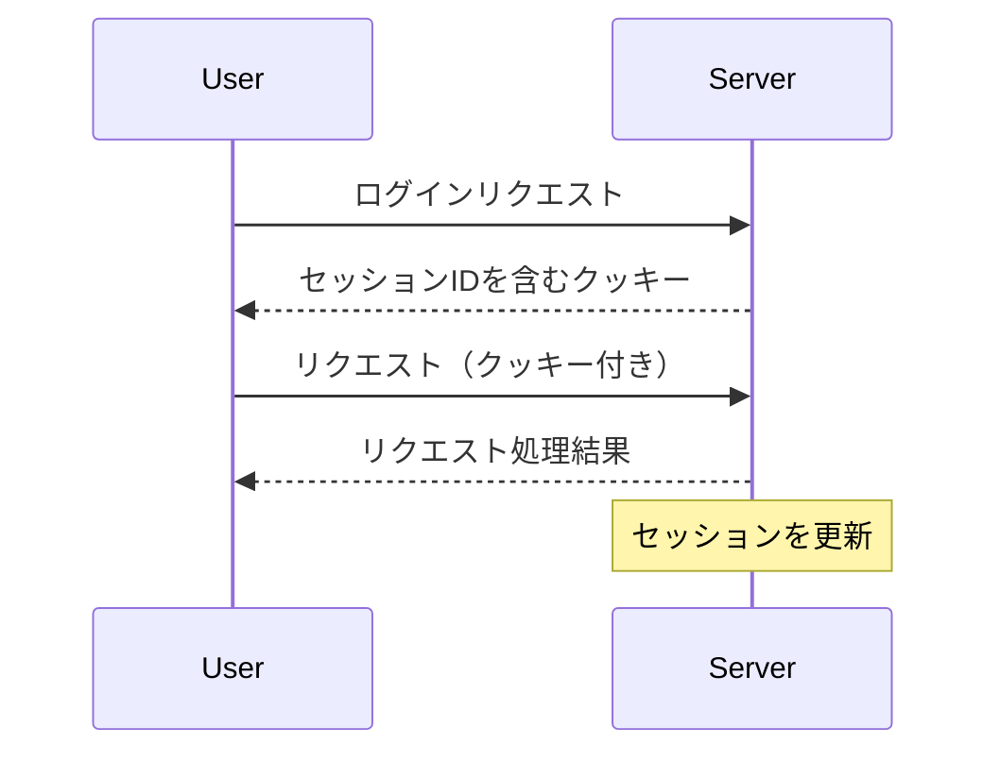

# セッション管理

## 概要
セッション管理は、ユーザーのログイン状態やその関連情報を保持し、適切に管理するための仕組みです。これにより、ユーザーはアプリケーションを利用する際に、毎回ログイン情報を入力する必要がなくなります。

## なぜ重要か
セッション管理は、ユーザーエクスペリエンスを向上させるだけでなく、セキュリティの観点からも重要です。適切なセッション管理により、ユーザーの情報を保護し、不正アクセスを防ぐことができます。

## 基本の流れ
1. **ユーザーがログイン**: ユーザーがログインすると、セッションが開始されます。
2. **セッションIDの生成**: サーバーは一意のセッションIDを生成し、ユーザーに関連付けます。
3. **クッキーの設定**: セッションIDはクッキーに保存され、ブラウザに送信されます。
4. **リクエストの処理**: ユーザーがアプリケーションを利用する際、クッキーからセッションIDを取得し、サーバーで認証を行います。
5. **セッションの更新**: 一定の時間が経過する前に、セッションを更新することで、ユーザーのログイン状態を維持します。

## 主要コンポーネント
- **セッションID**: ユーザーのセッションを識別するための一意のID。
- **リフレッシュトークン**: セッションを延長するためのトークン。
- **クッキー**: セッション情報をブラウザに保存するための仕組み。

## 外部/内部インターフェース
- **クッキーの設定**: `set_session_cookie_with_expiration`関数を使用して、セッションIDをクッキーに設定します。
- **セッション情報の抽出**: `extract_session_information`関数を使用して、リクエストからセッション情報を取得します。

## 例（ユーザー視点のシナリオ）
1. ユーザーがアプリケーションにログインすると、サーバーはセッションIDを生成し、クッキーに保存します。
2. ユーザーがアプリケーションを利用するたびに、クッキーからセッションIDを取得し、サーバーで認証を行います。
3. 一定時間が経過すると、サーバーはセッションを更新し、ユーザーはログイン状態を維持します。

## 制約と既知の注意点
- セッションは一定の時間が経過すると自動的に無効になります。
- セッションIDが漏洩すると、不正アクセスのリスクが高まります。
- クッキーのサイズ制限に注意が必要です。

## 用語集
- **セッションID**: ユーザーのセッションを識別するための一意の識別子。
- **リフレッシュトークン**: セッションを延長するために使用されるトークン。
- **クッキー**: ブラウザに保存される小さなデータファイル。

## 関連ファイル
- `src/common/session/cookie.rs`
- `src/common/session/mod.rs`
- `src/common/session/refresh_pair_expiration.rs`
- `src/common/session/refresh_token.rs`
- `src/common/session/session_expiration.rs`
- `src/common/session/session_id.rs`
- `src/common/session/session_series.rs`
- `src/middlewares/manage_session/dsl/authenticate.rs`
- `src/middlewares/manage_session/dsl/extract_session_info.rs`
- `src/middlewares/manage_session/dsl/manage_session.rs`
- `src/middlewares/manage_session/dsl/mitigate_session_theft.rs`
- `src/middlewares/manage_session/dsl/reauthenticate.rs`
- `src/middlewares/manage_session/dsl/refresh_session_series.rs`
- `src/middlewares/manage_session/dsl/update_refresh_token.rs`
- `src/middlewares/manage_session/dsl/update_session.rs`
- `src/middlewares/start_session/dsl/assign_refresh_pair.rs`
- `src/middlewares/start_session/dsl/assign_session_id.rs`
- `src/middlewares/start_session/dsl/start_session.rs`