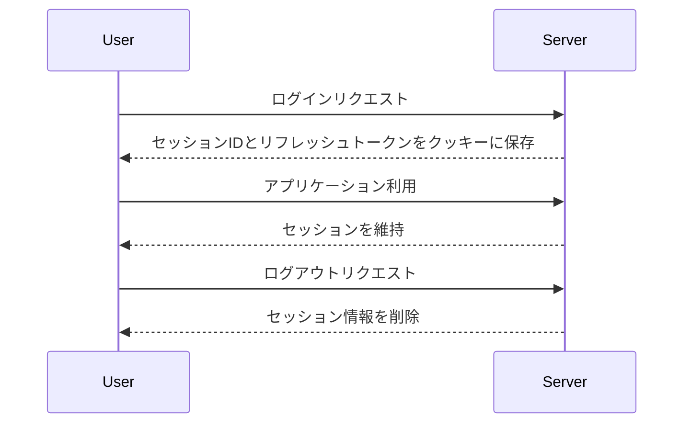

# セッション管理

## 概要
セッション管理は、ユーザーのログイン状態を維持し、セキュリティを確保するための重要な機能です。これにより、ユーザーがアプリケーションを使用している間、認証情報を安全に管理し、必要に応じて更新することができます。

## なぜ重要か
セッション管理は、ユーザーエクスペリエンスを向上させるだけでなく、セキュリティを強化するためにも不可欠です。適切なセッション管理により、ユーザーは再度ログインすることなく、アプリケーションを快適に利用できる一方で、セッションの不正利用を防ぐことができます。

## 基本の流れ
1. **セッションの開始**: ユーザーがログインすると、セッションIDとリフレッシュトークンが生成され、クッキーに保存されます。
2. **セッションの維持**: ユーザーがアプリケーションを利用している間、セッションがアクティブであることを確認します。セッションが有効な場合、ユーザーは再度ログインする必要がありません。
3. **セッションの更新**: セッションが期限切れになる前に、リフレッシュトークンを使用して新しいセッションIDを取得し、クッキーを更新します。
4. **セッションの終了**: ユーザーがログアウトすると、セッション情報が削除され、クッキーも無効化されます。

## 主要コンポーネント
- **セッションID**: ユーザーのセッションを一意に識別するためのトークン。
- **リフレッシュトークン**: セッションを更新するために使用されるトークン。
- **クッキー**: セッション情報をブラウザに保存するための仕組み。

## 外部/内部インターフェース
- **外部インターフェース**: ユーザーがログイン、ログアウト、アプリケーションを利用する際のリクエストとレスポンス。
- **内部インターフェース**: セッションの生成、更新、削除を行うための関数やメソッド。

## 例（ユーザー視点のシナリオ）
1. ユーザーがアプリケーションにログインすると、セッションIDとリフレッシュトークンが生成されます。
2. ユーザーがアプリケーションを利用している間、セッションが維持され、再度ログインする必要がありません。
3. セッションが期限切れになる前に、リフレッシュトークンを使用して新しいセッションIDが生成され、クッキーが更新されます。
4. ユーザーがログアウトすると、セッション情報が削除され、クッキーも無効化されます。

## 制約と既知の注意点
- セッションの有効期限を適切に設定しないと、セキュリティリスクが高まります。
- リフレッシュトークンの管理が不適切だと、セッションの不正利用が発生する可能性があります。

## 用語集
- **セッションID**: ユーザーのセッションを識別するための一意のトークン。
- **リフレッシュトークン**: セッションを更新するために使用されるトークン。
- **クッキー**: ウェブブラウザに保存される小さなデータファイル。

## 関連ファイル
- `src/common/session/mod.rs`
- `src/common/session/cookie.rs`
- `src/common/session/refresh_token.rs`
- `src/common/session/session_id.rs`
- `src/common/session/session_series.rs`
- `src/common/session/session_expiration.rs`
- `src/common/session/refresh_pair_expiration.rs`
- `src/middlewares/manage_session/mod.rs`
- `src/middlewares/manage_session/dsl/manage_session.rs`
- `src/middlewares/start_session/mod.rs`
- `src/middlewares/start_session/dsl/start_session.rs`