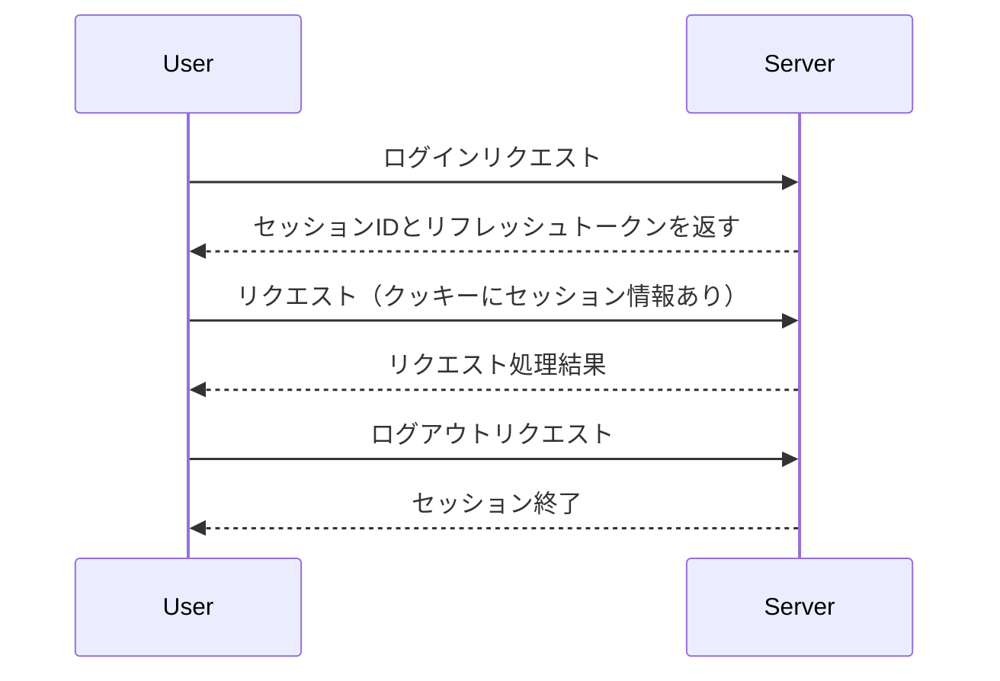

# セッション管理

## 概要
セッション管理は、ユーザーがアプリケーションにログインしている間、その状態を維持するための仕組みです。これにより、ユーザーは再度ログインすることなく、アプリケーションを利用し続けることができます。セッションは、ユーザーの識別情報や認証情報を安全に保存し、必要に応じて更新することが可能です。

## なぜ重要か
セッション管理は、ユーザーエクスペリエンスを向上させるだけでなく、セキュリティの観点からも重要です。適切なセッション管理により、ユーザーの情報を保護し、不正アクセスを防ぐことができます。また、セッションの有効期限を設定することで、一定時間操作が行われなかった場合に自動的にログアウトすることができ、セキュリティを強化します。

## 基本の流れ
1. **セッションの開始**: ユーザーがログインすると、新しいセッションが作成され、セッションIDとリフレッシュトークンが生成されます。
2. **クッキーの設定**: セッションIDとリフレッシュトークンは、クッキーとしてブラウザに保存されます。これにより、ユーザーのブラウザが次回リクエストを送信する際に、これらの情報を自動的に送信します。
3. **セッションの管理**: ユーザーがアプリケーションを利用する際、セッションの有効性が確認され、必要に応じてセッションが更新されます。
4. **セッションの終了**: ユーザーがログアウトするか、セッションの有効期限が切れると、セッションは終了します。

## 主要コンポーネント
- **セッションID**: 各セッションを一意に識別するためのトークン。
- **リフレッシュトークン**: セッションを更新するために使用されるトークン。
- **クッキー**: セッション情報をブラウザに保存するための仕組み。

## 外部/内部インターフェース
- **外部インターフェース**: ユーザーがログインするためのAPIエンドポイント、セッション情報を取得するためのAPIエンドポイント。
- **内部インターフェース**: セッションの生成、更新、検証を行うための関数やモジュール。

## 例（ユーザー視点のシナリオ）
1. ユーザーがアプリケーションにログインすると、サーバーはセッションIDとリフレッシュトークンを生成し、クッキーに保存します。
2. ユーザーがアプリケーションを利用する際、ブラウザは自動的にクッキーを送信し、サーバーはセッションの有効性を確認します。
3. ユーザーが一定時間操作を行わなかった場合、セッションは自動的に終了し、再度ログインが必要になります。

## 制約と既知の注意点
- セッションの有効期限を設定することで、セキュリティを強化する必要がありますが、ユーザーエクスペリエンスに影響を与える可能性があります。
- セッション情報が漏洩しないよう、クッキーはセキュアに設定する必要があります。

## 用語集
- **セッション**: ユーザーがアプリケーションにログインしている間の状態を保持する仕組み。
- **クッキー**: ブラウザに保存される小さなデータで、セッション情報を保持するために使用される。
- **リフレッシュトークン**: セッションを更新するために使用されるトークン。

## 関連ファイル
- `src/common/session/mod.rs`
- `src/common/session/cookie.rs`
- `src/common/session/refresh_token.rs`
- `src/common/session/session_id.rs`
- `src/common/session/session_series.rs`
- `src/common/session/session_expiration.rs`
- `src/common/session/refresh_pair_expiration.rs`
- `src/middlewares/manage_session/mod.rs`
- `src/middlewares/manage_session/dsl/manage_session.rs`
- `src/middlewares/start_session/mod.rs`
- `src/middlewares/start_session/dsl/start_session.rs`