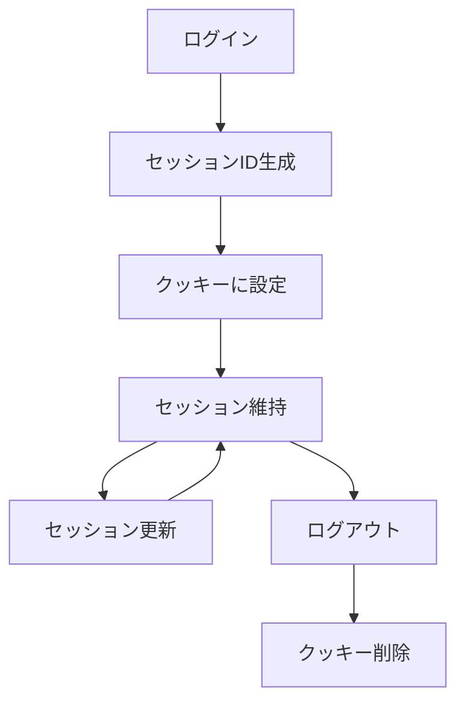

# セッション管理
セッション管理は、ユーザーがアプリケーションにログインしている間の状態を保持し、ユーザーの操作を追跡するための仕組みです。これにより、ユーザーはアプリケーションを利用する際に、再度ログインすることなくスムーズに操作を続けることができます。

## 概要
セッション管理は、ユーザーの認証情報や状態を保持するために、セッションIDやリフレッシュトークンを使用します。これにより、ユーザーは一度ログインすれば、一定の時間内は再度認証を求められることなくサービスを利用できます。

## なぜ重要か
セッション管理は、ユーザーエクスペリエンスの向上に寄与します。適切に管理されたセッションは、ユーザーがアプリケーションを快適に利用できるようにし、セキュリティを確保するためにも重要です。特に、セッションの有効期限やリフレッシュトークンの管理は、セキュリティリスクを低減するために不可欠です。

## 仕組みと基本の流れ
1. **ログイン**: ユーザーがログインすると、サーバーはセッションIDとリフレッシュトークンを生成します。
2. **クッキーの設定**: 生成されたセッションIDとリフレッシュトークンは、クッキーとしてブラウザに保存されます。
3. **セッションの維持**: ユーザーがアプリケーションを利用する際、サーバーはクッキーからセッションIDを取得し、ユーザーの状態を確認します。
4. **セッションの更新**: 一定の時間が経過すると、リフレッシュトークンを使用して新しいセッションIDを発行し、クッキーを更新します。
5. **ログアウト**: ユーザーがログアウトすると、クッキーは削除され、セッションは終了します。

## 仕様・特徴（詳細）
### データ・状態・ルール
- **セッションID**: ユーザーのセッションを一意に識別するためのトークンです。30分の有効期限があります。[1]
- **リフレッシュトークン**: セッションを延長するためのトークンで、最大400日間有効です。[2]
- **クッキーの設定**: セッションIDとリフレッシュトークンは、HTTPクッキーとしてブラウザに保存されます。これにより、ユーザーが再度ログインすることなく、セッションを維持できます。[3]

### フローとアルゴリズム
1. ユーザーがログインすると、サーバーはセッションIDとリフレッシュトークンを生成します。
2. 生成されたトークンは、クッキーとしてブラウザに保存されます。
3. ユーザーがアプリケーションを利用する際、サーバーはクッキーからセッションIDを取得し、ユーザーの状態を確認します。
4. セッションが有効な場合、ユーザーはサービスを利用できます。
5. セッションが無効な場合、再度ログインを求められます。

### 例外・コーナーケース・既知の落とし穴
- **セッションの盗用**: セッションIDが第三者に知られると、悪用される可能性があります。これを防ぐために、セッションの盗用を検知し、適切な対策を講じる必要があります。[4]
- **クッキーの有効期限切れ**: クッキーの有効期限が切れると、ユーザーは再度ログインする必要があります。これを適切に管理することが重要です。

### 制約・前提・非機能要件
- セッション管理は、セキュリティを考慮して設計される必要があります。特に、セッションIDやリフレッシュトークンは安全に生成され、保存されるべきです。
- セッションの有効期限や更新のタイミングは、システムの要件に応じて設定される必要があります。

## 利用シナリオ（ユーザー視点）
- ユーザーがアプリケーションにログインし、セッションが開始されます。ユーザーは、一定の時間内に再度ログインすることなく、アプリケーションを利用し続けることができます。
- セッションが切れる前に、リフレッシュトークンを用いて新しいセッションIDが発行され、ユーザーは引き続きサービスを利用できます。

## 運用のヒント / ベストプラクティス（bad knowhow 可）
- セッションの有効期限を適切に設定し、ユーザーに不便をかけないようにすることが重要です。
- セッションの盗用を防ぐために、セッションの監視や異常検知の仕組みを導入することが推奨されます。
- クッキーのセキュリティ設定（Secure、HttpOnly、SameSite）を適切に行うことで、セキュリティを強化できます。

## 用語集
- **セッションID**: ユーザーのセッションを識別するための一意のトークン。
- **リフレッシュトークン**: セッションを延長するためのトークン。
- **クッキー**: ブラウザに保存される小さなデータで、セッション情報を保持するために使用される。

## 関連ファイル
- [src/common/session/cookie.rs](https://github.com/netmateapp/netmate-api/tree/main/src/common/session/cookie.rs)
- [src/common/session/mod.rs](https://github.com/netmateapp/netmate-api/tree/main/src/common/session/mod.rs)
- [src/common/session/refresh_pair_expiration.rs](https://github.com/netmateapp/netmate-api/tree/main/src/common/session/refresh_pair_expiration.rs)
- [src/common/session/refresh_token.rs](https://github.com/netmateapp/netmate-api/tree/main/src/common/session/refresh_token.rs)
- [src/common/session/session_expiration.rs](https://github.com/netmateapp/netmate-api/tree/main/src/common/session/session_expiration.rs)
- [src/common/session/session_id.rs](https://github.com/netmateapp/netmate-api/tree/main/src/common/session/session_id.rs)
- [src/common/session/session_series.rs](https://github.com/netmateapp/netmate-api/tree/main/src/common/session/session_series.rs)
- [src/endpoints/auth/sign_in/endpoint.rs](https://github.com/netmateapp/netmate-api/tree/main/src/endpoints/auth/sign_in/endpoint.rs)
- [src/endpoints/auth/sign_out/endpoint.rs](https://github.com/netmateapp/netmate-api/tree/main/src/endpoints/auth/sign_out/endpoint.rs)
- [src/middlewares/manage_session/dsl/manage_session.rs](https://github.com/netmateapp/netmate-api/tree/main/src/middlewares/manage_session/dsl/manage_session.rs)
- [src/middlewares/manage_session/dsl/mitigate_session_theft.rs](https://github.com/netmateapp/netmate-api/tree/main/src/middlewares/manage_session/dsl/mitigate_session_theft.rs)
- [src/middlewares/manage_session/interpreter/mitigate_session_theft.rs](https://github.com/netmateapp/netmate-api/tree/main/src/middlewares/manage_session/interpreter/mitigate_session_theft.rs)
- [src/middlewares/start_session/dsl/start_session.rs](https://github.com/netmateapp/netmate-api/tree/main/src/middlewares/start_session/dsl/start_session.rs)

## 根拠注釈
[1]: https://github.com/netmateapp/netmate-api/tree/main/src/common/session/cookie.rs#L8  
[2]: https://github.com/netmateapp/netmate-api/tree/main/src/common/session/cookie.rs#L12  
[3]: https://github.com/netmateapp/netmate-api/tree/main/src/common/session/cookie.rs#L18  
[4]: https://github.com/netmateapp/netmate-api/tree/main/src/middlewares/manage_session/dsl/mitigate_session_theft.rs#L10