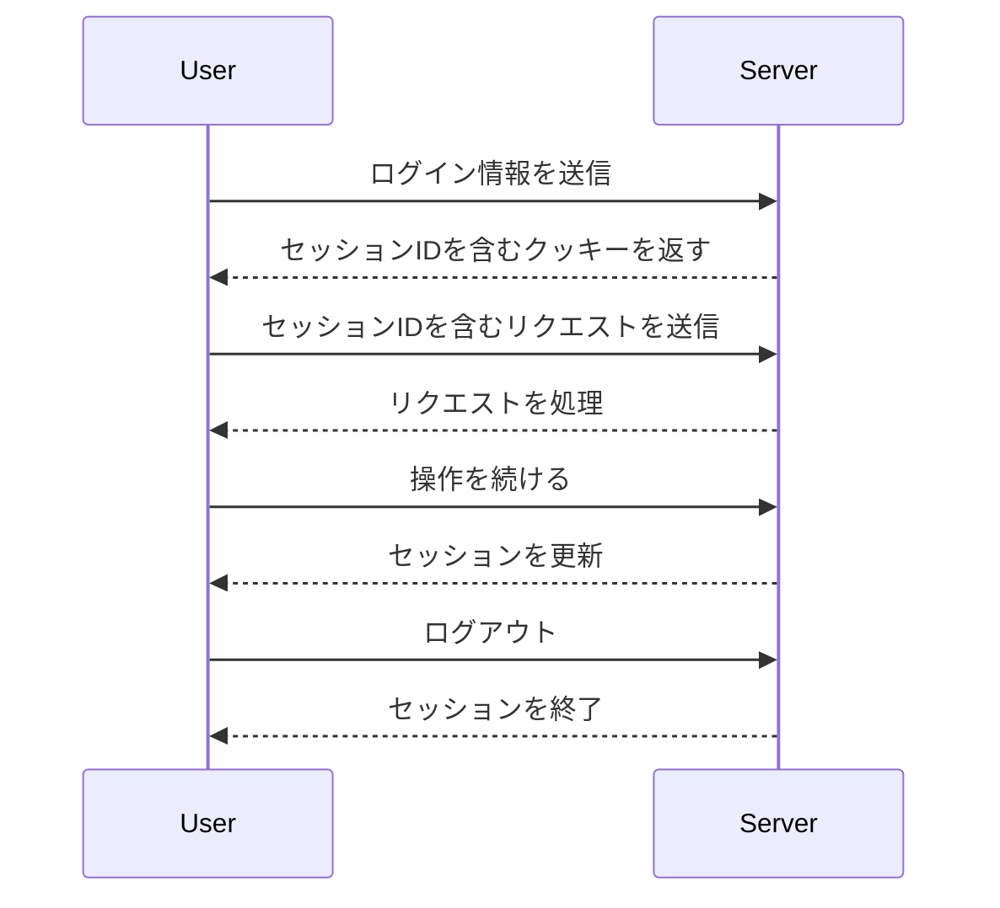

# セッション管理

## 概要
セッション管理は、ユーザーがアプリケーションにログインしている間、その状態を維持するための仕組みです。これにより、ユーザーは再度ログインすることなく、アプリケーション内での操作を続けることができます。

## なぜ重要か
セッション管理は、ユーザー体験を向上させるだけでなく、セキュリティの観点からも重要です。適切なセッション管理を行うことで、不正アクセスやセッションの盗用を防ぎ、ユーザーのデータを保護します。

## 基本の流れ
1. **ログイン**: ユーザーがアカウント情報を入力し、認証が成功すると、セッションが開始されます。
2. **セッションIDの生成**: サーバーは一意のセッションIDを生成し、クッキーとしてユーザーのブラウザに保存します。
3. **リクエストの処理**: ユーザーがアプリケーション内で操作を行うたびに、セッションIDがサーバーに送信され、ユーザーの状態が確認されます。
4. **セッションの更新**: 一定の時間が経過する前に、セッションが自動的に更新され、ユーザーはログイン状態を維持できます。
5. **ログアウト**: ユーザーがログアウトすると、セッションは終了し、セッションIDは無効化されます。

## 主要コンポーネント
- **セッションID**: 各ユーザーセッションを識別するための一意の識別子。
- **リフレッシュトークン**: セッションを延長するために使用されるトークン。
- **クッキー**: セッションIDやリフレッシュトークンをブラウザに保存するための仕組み。

## 外部/内部インターフェース
- **クッキー管理**: セッションIDやリフレッシュトークンをクッキーとして設定・取得するための関数。
- **認証機能**: セッションIDを用いてユーザーの認証を行う機能。
- **セッション更新機能**: セッションの有効期限を延長するための機能。

## 例（ユーザー視点のシナリオ）
1. ユーザーがログインフォームに情報を入力し、送信します。
2. サーバーは認証に成功し、セッションIDを生成してクッキーに保存します。
3. ユーザーがアプリケーション内でページを移動するたびに、セッションIDが送信され、ユーザーの状態が維持されます。
4. 一定時間後、ユーザーが再度操作を行うと、セッションが更新され、ログイン状態が維持されます。
5. ユーザーがログアウトボタンをクリックすると、セッションが終了し、セッションIDが無効化されます。

## 制約と既知の注意点
- セッションの有効期限を設定することで、セキュリティを強化できますが、ユーザーの利便性にも影響を与える可能性があります。
- セッションIDが漏洩すると、不正アクセスのリスクが高まります。適切なセキュリティ対策が必要です。

## 用語集
- **セッション**: ユーザーがアプリケーションにログインしている間の状態。
- **セッションID**: 各セッションを識別するための一意の識別子。
- **リフレッシュトークン**: セッションを延長するために使用されるトークン。

## 関連ファイル
- `src/common/session/cookie.rs`
- `src/common/session/mod.rs`
- `src/common/session/refresh_pair_expiration.rs`
- `src/common/session/refresh_token.rs`
- `src/common/session/session_expiration.rs`
- `src/common/session/session_id.rs`
- `src/common/session/session_series.rs`
- `src/middlewares/manage_session/dsl/authenticate.rs`
- `src/middlewares/manage_session/dsl/extract_session_info.rs`
- `src/middlewares/manage_session/dsl/manage_session.rs`
- `src/middlewares/manage_session/dsl/mitigate_session_theft.rs`
- `src/middlewares/manage_session/dsl/reauthenticate.rs`
- `src/middlewares/manage_session/dsl/refresh_session_series.rs`
- `src/middlewares/manage_session/dsl/update_refresh_token.rs`
- `src/middlewares/manage_session/dsl/update_session.rs`
- `src/middlewares/start_session/dsl/assign_refresh_pair.rs`
- `src/middlewares/start_session/dsl/assign_session_id.rs`
- `src/middlewares/start_session/dsl/start_session.rs`