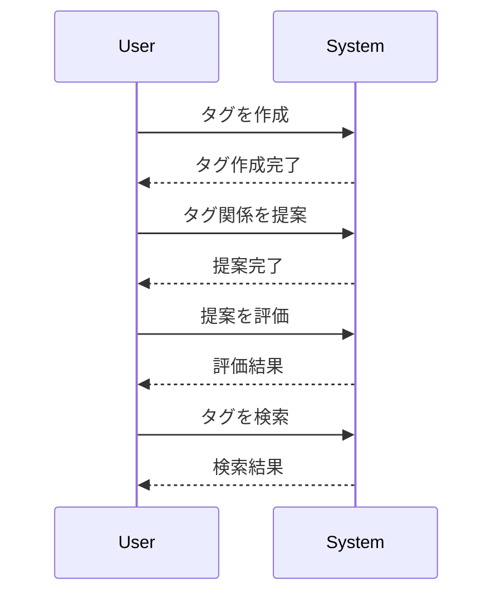

# タグ

## 概要
タグは、情報を整理し、関連性を持たせるための重要な要素です。本システムでは、タグの階層構造や言語グループを管理し、タグ間の関係性を提案・評価する機能を提供します。

## なぜ重要か
タグを適切に管理することで、情報の検索性や整理が向上し、ユーザーが必要な情報に迅速にアクセスできるようになります。また、タグの関係性を評価することで、関連情報をより効果的に提示することが可能になります。

## 基本の流れ
1. **タグの作成**: ユーザーが新しいタグを作成します。
2. **タグの提案**: タグ間の関係性を提案します（例: 包含関係や同値関係）。
3. **タグの評価**: 提案された関係性を評価し、必要に応じて修正します。
4. **タグの検索**: タグを使用して関連情報を検索します。

## 主要コンポーネント
- **タグ階層 (TagHierarchy)**: タグの上位・下位関係を管理します。
- **言語グループ (LanguageGroup)**: タグが属する言語を管理します。
- **提案操作 (ProposalOperation)**: タグの提案状態を管理します。
- **Redis タグ情報 (RedisTagInfo)**: タグの情報をRedisに保存し、効率的に管理します。
- **タグ関係 (TagRelation)**: タグ間の関係性を定義し、検証します。

## 外部/内部インターフェース
- **APIエンドポイント**:
  - `ListRelatedTags`: タグのリストを取得します。
  - `ProposeTagRelation`: タグの関係性を提案します。
- **データベース**: ScyllaDBを使用してタグ情報を管理します。

## 例（ユーザー視点のシナリオ）
1. ユーザーが「プログラミング」というタグを作成します。
2. システムが「プログラミング」と「コーディング」の関係性を提案します。
3. ユーザーが提案を評価し、承認します。
4. ユーザーが「プログラミング」タグを使って関連する情報を検索します。

## 制約と既知の注意点
- タグのリストは、最大で10件まで表示されます（`PAGE_SIZE`）。
- タグの関係性を提案する際、既存のタグとの整合性を確認する必要があります。
- エラーハンドリングが適切に行われていない場合、ユーザーに不明なエラーメッセージが表示されることがあります。

## 用語集
- **タグ (Tag)**: 情報を分類するためのラベル。
- **階層 (Hierarchy)**: タグ間の上位・下位関係。
- **提案 (Proposal)**: タグ間の関係性を示す提案。
- **安定性 (Stability)**: タグの信頼性や確実性を示す指標。

## 関連ファイル
- `TagHierarchy`
- `LanguageGroup`
- `ProposalOperation`
- `RedisTagInfo`
- `TagRelation`
- `TagInfo`
- `TagName`
- `TopTagId`
- `Endpoints`
- `エラーハンドリング`