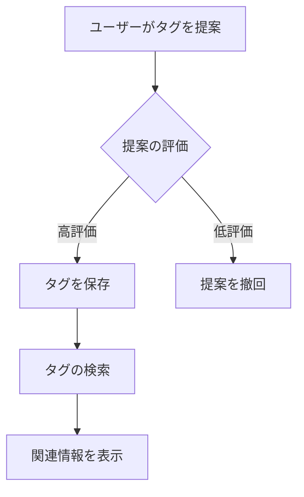

# タグ
タグは、情報を整理し、特定のテーマやカテゴリに関連付けるためのラベルです。これにより、データの検索やフィルタリングが容易になります。

## 概要
タグは、データやコンテンツを分類するための重要な要素です。特に、ユーザーが情報を効率的に見つけるために役立ちます。タグは階層的に構成されることがあり、上位タグや下位タグ、同値タグなどの関係性を持つことができます。

## なぜ重要か
タグを使用することで、情報の整理が進み、ユーザーは必要な情報に迅速にアクセスできます。また、タグの関係性を利用することで、関連する情報を簡単に見つけることができ、ユーザー体験が向上します。

## 仕組みと基本の流れ
タグは、特定のデータに対して付与され、データベースに保存されます。ユーザーがタグを検索したり、フィルタリングしたりする際に、システムはこれらのタグを参照して関連情報を提供します。タグの関係性は、データの整合性を保ちながら、ユーザーがより良い検索結果を得るために利用されます。

## 仕様・特徴（詳細）
### データ・状態・ルール
- **タグ階層 (TagHierarchy)**: タグは上位、同値、下位の関係を持ち、整数からの変換や表示用フォーマットが提供されています。[1]
- **言語グループ (LanguageGroup)**: タグは異なる言語に対応しており、言語からの変換が可能です。[2]
- **非トップタグID (NonTopTagId)**: トップタグでないことを保証するための構造体が存在します。[3]
- **提案操作 (ProposalOperation)**: タグの評価状態を示すための列挙型が定義されています。[4]
- **Redisタグ情報 (RedisTagInfo)**: タグの順序や評価、提案の有無を管理するためのビットフィールドが使用されています。[5]

### フローとアルゴリズム（必要なら Mermaid 図）
以下は、タグの提案と評価のフローを示す図です。

### 例外・コーナーケース・既知の落とし穴
- タグの提案が低評価の場合、提案が撤回される可能性があります。この場合、ユーザーは再提案を行う必要があります。
- タグの階層が不適切に設定されていると、検索結果が不正確になることがあります。

### 制約・前提・非機能要件
- タグの提案や評価は、適切なエラーハンドリングを行う必要があります。[6]
- タグ情報は、RedisやScyllaDBを使用して管理されます。[7]

## 利用シナリオ（ユーザー視点）
ユーザーは、特定のトピックに関連するタグを検索し、関連情報を迅速に見つけることができます。また、ユーザーが新しいタグを提案することで、情報の整理が進みます。

## 運用のヒント / ベストプラクティス（bad knowhow 可）
- タグの階層を適切に設定することで、検索結果の精度が向上します。
- 提案されたタグは、定期的に評価し、不要なタグは撤回することが推奨されます。

## 用語集（本文と対応づけて）
- **タグ**: データを分類するためのラベル。
- **階層**: タグ間の上位・下位関係。
- **提案**: 新しいタグを追加するためのリクエスト。

## 関連ファイル
- [src/common/tag/hierarchy.rs](https://github.com/netmateapp/netmate-api/tree/main/src/common/tag/hierarchy.rs)
- [src/common/tag/language_group.rs](https://github.com/netmateapp/netmate-api/tree/main/src/common/tag/language_group.rs)
- [src/common/tag/mod.rs](https://github.com/netmateapp/netmate-api/tree/main/src/common/tag/mod.rs)
- [src/common/tag/non_top_tag.rs](https://github.com/netmateapp/netmate-api/tree/main/src/common/tag/non_top_tag.rs)
- [src/common/tag/proposal_operation.rs](https://github.com/netmateapp/netmate-api/tree/main/src/common/tag/proposal_operation.rs)
- [src/common/tag/redis_tag_info.rs](https://github.com/netmateapp/netmate-api/tree/main/src/common/tag/redis_tag_info.rs)
- [src/common/tag/relation.rs](https://github.com/netmateapp/netmate-api/tree/main/src/common/tag/relation.rs)
- [src/common/tag/tag_id.rs](https://github.com/netmateapp/netmate-api/tree/main/src/common/tag/tag_id.rs)
- [src/common/tag/tag_info.rs](https://github.com/netmateapp/netmate-api/tree/main/src/common/tag/tag_info.rs)
- [src/common/tag/tag_name.rs](https://github.com/netmateapp/netmate-api/tree/main/src/common/tag/tag_name.rs)
- [src/common/tag/top_tag.rs](https://github.com/netmateapp/netmate-api/tree/main/src/common/tag/top_tag.rs)
- [src/endpoints/tag/list/dsl.rs](https://github.com/netmateapp/netmate-api/tree/main/src/endpoints/tag/list/dsl.rs)
- [src/endpoints/tag/list/endpoint.rs](https://github.com/netmateapp/netmate-api/tree/main/src/endpoints/tag/list/endpoint.rs)
- [src/endpoints/tag/list/interpreter.rs](https://github.com/netmateapp/netmate-api/tree/main/src/endpoints/tag/list/interpreter.rs)
- [src/endpoints/tag/list/mod.rs](https://github.com/netmateapp/netmate-api/tree/main/src/endpoints/tag/list/mod.rs)
- [src/endpoints/tag/proposal/mod.rs](https://github.com/netmateapp/netmate-api/tree/main/src/endpoints/tag/proposal/mod.rs)
- [src/endpoints/tag/proposal/propose/dsl/mod.rs](https://github.com/netmateapp/netmate-api/tree/main/src/endpoints/tag/proposal/propose/dsl/mod.rs)
- [src/endpoints/tag/proposal/propose/dsl/propose.rs](https://github.com/netmateapp/netmate-api/tree/main/src/endpoints/tag/proposal/propose/dsl/propose.rs)
- [src/endpoints/tag/proposal/propose/dsl/relate_hierarchical_tags.rs](https://github.com/netmateapp/netmate-api/tree/main/src/endpoints/tag/proposal/propose/dsl/relate_hierarchical_tags.rs)
- [src/endpoints/tag/proposal/propose/dsl/validate_topology.rs](https://github.com/netmateapp/netmate-api/tree/main/src/endpoints/tag/proposal/propose/dsl/validate_topology.rs)
- [src/endpoints/tag/proposal/propose/endpoint.rs](https://github.com/netmateapp/netmate-api/tree/main/src/endpoints/tag/proposal/propose/endpoint.rs)
- [src/endpoints/tag/proposal/propose/interpreter/mod.rs](https://github.com/netmateapp/netmate-api/tree/main/src/endpoints/tag/proposal/propose/interpreter/mod.rs)
- [src/endpoints/tag/proposal/propose/interpreter/propose.rs](https://github.com/netmateapp/netmate-api/tree/main/src/endpoints/tag/proposal/propose/interpreter/propose.rs)
- [src/endpoints/tag/proposal/propose/interpreter/update_tag_list.rs](https://github.com/netmateapp/netmate-api/tree/main/src/endpoints/tag/proposal/propose/interpreter/update_tag_list.rs)
- [src/endpoints/tag/proposal/propose/interpreter/validate_topology.rs](https://github.com/netmateapp/netmate-api/tree/main/src/endpoints/tag/proposal/propose/interpreter/validate_topology.rs)
- [src/endpoints/tag/proposal/withdraw/dsl.rs](https://github.com/netmateapp/netmate-api/tree/main/src/endpoints/tag/proposal/withdraw/dsl.rs)
- [src/endpoints/tag/proposal/withdraw/endpoint.rs](https://github.com/netmateapp/netmate-api/tree/main/src/endpoints/tag/proposal/withdraw/endpoint.rs)
- [src/endpoints/tag/proposal/withdraw/interpreter.rs](https://github.com/netmateapp/netmate-api/tree/main/src/endpoints/tag/proposal/withdraw/interpreter.rs)
- [src/endpoints/tag/proposal/withdraw/mod.rs](https://github.com/netmateapp/netmate-api/tree/main/src/endpoints/tag/proposal/withdraw/mod.rs)
- [src/endpoints/tag/rating/get/dsl.rs](https://github.com/netmateapp/netmate-api/tree/main/src/endpoints/tag/rating/get/dsl.rs)
- [src/endpoints/tag/rating/get/endpoint.rs](https://github.com/netmateapp/netmate-api/tree/main/src/endpoints/tag/rating/get/endpoint.rs)
- [src/endpoints/tag/rating/get/interpreter.rs](https://github.com/netmateapp/netmate-api/tree/main/src/endpoints/tag/rating/get/interpreter.rs)
- [src/endpoints/tag/rating/get/mod.rs](https://github.com/netmateapp/netmate-api/tree/main/src/endpoints/tag/rating/get/mod.rs)
- [src/endpoints/tag/rating/rate/dsl.rs](https://github.com/netmateapp/netmate-api/tree/main/src/endpoints/tag/rating/rate/dsl.rs)
- [src/endpoints/tag/rating/rate/endpoint.rs](https://github.com/netmateapp/netmate-api/tree/main/src/endpoints/tag/rating/rate/endpoint.rs)
- [src/endpoints/tag/rating/rate/interpreter.rs](https://github.com/netmateapp/netmate-api/tree/main/src/endpoints/tag/rating/rate/interpreter.rs)
- [src/endpoints/tag/rating/rate/mod.rs](https://github.com/netmateapp/netmate-api/tree/main/src/endpoints/tag/rating/rate/mod.rs)
- [src/endpoints/tag/rating/unrate/dsl.rs](https://github.com/netmateapp/netmate-api/tree/main/src/endpoints/tag/rating/unrate/dsl.rs)
- [src/endpoints/tag/rating/unrate/endpoint.rs](https://github.com/netmateapp/netmate-api/tree/main/src/endpoints/tag/rating/unrate/endpoint.rs)
- [src/endpoints/tag/rating/unrate/interpreter.rs](https://github.com/netmateapp/netmate-api/tree/main/src/endpoints/tag/rating/unrate/interpreter.rs)
- [src/endpoints/tag/rating/unrate/mod.rs](https://github.com/netmateapp/netmate-api/tree/main/src/endpoints/tag/rating/unrate/mod.rs)
- [src/endpoints/tag/search/dsl.rs](https://github.com/netmateapp/netmate-api/tree/main/src/endpoints/tag/search/dsl.rs)
- [src/endpoints/tag/search/endpoint.rs](https://github.com/netmateapp/netmate-api/tree/main/src/endpoints/tag/search/endpoint.rs)
- [src/endpoints/tag/search/interpreter.rs](https://github.com/netmateapp/netmate-api/tree/main/src/endpoints/tag/search/interpreter.rs)

## 根拠注釈
[1]: https://github.com/netmateapp/netmate-api/tree/main/src/common/tag/hierarchy.rs  
[2]: https://github.com/netmateapp/netmate-api/tree/main/src/common/tag/language_group.rs  
[3]: https://github.com/netmateapp/netmate-api/tree/main/src/common/tag/non_top_tag.rs  
[4]: https://github.com/netmateapp/netmate-api/tree/main/src/common/tag/proposal_operation.rs  
[5]: https://github.com/netmateapp/netmate-api/tree/main/src/common/tag/redis_tag_info.rs  
[6]: https://github.com/netmateapp/netmate-api/tree/main/src/endpoints/tag/proposal/propose/interpreter/validate_topology.rs  
[7]: https://github.com/netmateapp/netmate-api/tree/main/src/endpoints/tag/proposal/propose/mod.rs