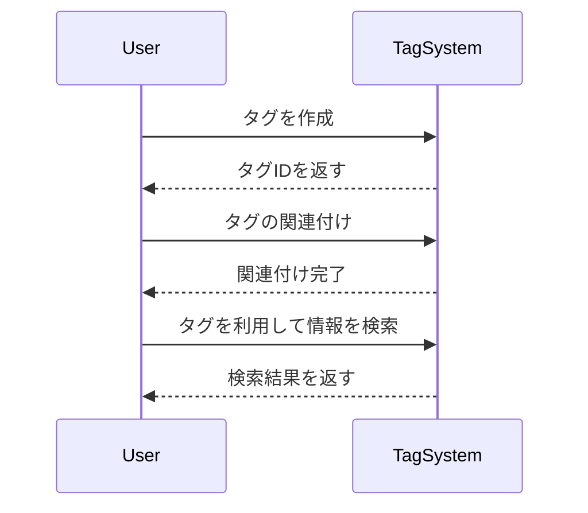

# タグ

## 概要
タグは、情報を整理し、関連性を持たせるためのラベルです。特に、異なる情報やデータの関係を示すために使用されます。タグは、階層的な関係を持つことができ、上位タグや下位タグとして分類されます。

## なぜ重要か
タグを使用することで、情報を効率的に検索・整理することが可能になります。特に、データが膨大な場合や多様な情報が存在する場合、タグによる分類は重要です。また、ユーザーが情報を見つけやすくするための手段としても機能します。

## 基本の流れ
1. **タグの作成**: 新しいタグを作成し、必要に応じて上位タグや下位タグを設定します。
2. **タグの関連付け**: タグ同士の関係を定義します。これにより、タグ間の階層関係が形成されます。
3. **タグの利用**: 作成したタグを用いて情報を整理し、検索を行います。

## 主要コンポーネント
- **タグID**: タグを一意に識別するためのID。
- **タグ名**: タグの名称。
- **タグ情報**: タグに関連するメタデータ（例: 提案中かどうか、安定性など）。
- **タグ階層**: タグ間の関係を示す情報（上位、同値、下位）。

## 外部/内部インターフェース
- **外部インターフェース**: タグの作成、関連付け、検索を行うAPIエンドポイント。
- **内部インターフェース**: タグのデータを管理するためのデータベースとのやり取り。

## 例（ユーザー視点のシナリオ）
ユーザーが「日本語」というタグを作成し、そのタグを「言語」という上位タグに関連付けます。その後、ユーザーは「日本語」を使って関連する情報を検索し、必要なデータを見つけます。

## 制約と既知の注意点
- タグ名は特定の文字数制限があり、過剰な長さのタグ名は受け付けられません。
- タグ間の関係は明確に定義されている必要があり、同じタグ間の関係を評価することはできません。

## 用語集
- **タグ**: 情報を分類するためのラベル。
- **上位タグ**: 他のタグを包含するタグ。
- **下位タグ**: 上位タグに属するタグ。
- **同値タグ**: 同じレベルのタグ同士の関係。

## 関連ファイル
- `src/common/tag/mod.rs`
- `src/common/tag/hierarchy.rs`
- `src/common/tag/language_group.rs`
- `src/common/tag/non_top_tag.rs`
- `src/common/tag/proposal_operation.rs`
- `src/common/tag/redis_tag_info.rs`
- `src/common/tag/relation.rs`
- `src/common/tag/tag_id.rs`
- `src/common/tag/tag_info.rs`
- `src/common/tag/tag_name.rs`
- `src/common/tag/top_tag.rs`
- `src/endpoints/tag/list/mod.rs`
- `src/endpoints/tag/proposal/mod.rs`
- `src/endpoints/tag/rating/mod.rs`
- `src/endpoints/tag/search/mod.rs`