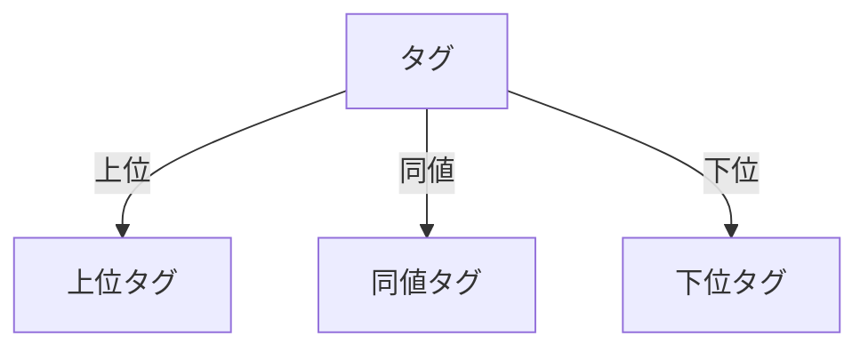

# タグ
タグは、情報やデータを分類・整理するためのラベルです。特に、関連性のある情報をグループ化し、検索やフィルタリングを容易にするために使用されます。

## 概要
タグは、特定のコンテンツやデータに対して付与されるラベルであり、情報の整理や検索を効率化します。タグは、階層的な関係を持つことができ、上位タグや下位タグとの関連性を示すことができます。

## なぜ重要か
タグを使用することで、情報の整理が容易になり、ユーザーが必要な情報を迅速に見つけることができます。また、タグの階層構造により、関連情報を視覚的に把握しやすくなります。

## 仕組みと基本の流れ
タグは、特定のデータに関連付けられ、階層的な関係を持つことができます。タグの関係は、上位タグ、同値タグ、下位タグとして分類されます。これにより、情報の関連性を明確にし、ユーザーが情報を効率的に検索できるようにします。

## 仕様・特徴（詳細）
### データ・状態・ルール
- タグは、`TagId`、`TagName`、`TagHierarchy`などのデータ構造を持ちます。
- タグは、上位タグ、同値タグ、下位タグの関係を持つことができます。
- タグの階層は、`TagHierarchy`列挙型で定義され、上位（Super）、同値（Equivalent）、下位（Sub）の3つの状態があります[1](https://github.com/netmateapp/netmate-api/tree/main/src/common/tag/hierarchy.rs)。

### フローとアルゴリズム（必要なら Mermaid 図）

この図は、タグが持つ階層的な関係を示しています。

### 例外・コーナーケース・既知の落とし穴
- 同じタグ間の関係を評価することはできません。これは、`validate_tag_relation`関数によって制御されています[2](https://github.com/netmateapp/netmate-api/tree/main/src/common/tag/relation.rs)。
- 同値関係では、下位タグのIDが上位タグのIDより小さくなければなりません。

### 制約・前提・非機能要件
- タグ名は、最大100文字の制限があります[3](https://github.com/netmateapp/netmate-api/tree/main/src/common/tag/tag_name.rs)。
- タグは、特定の言語グループに関連付けられます。

## 利用シナリオ（ユーザー視点）
ユーザーは、特定の情報を検索する際にタグを利用します。例えば、特定の言語に関連する情報を検索する場合、ユーザーはその言語に関連付けられたタグを使用して、情報を迅速に見つけることができます。

## 運用のヒント / ベストプラクティス（bad knowhow 可）
- タグの階層構造を適切に設計することで、情報の検索効率を向上させることができます。
- タグの命名規則を統一することで、ユーザーがタグを理解しやすくなります。

## 用語集（本文と対応づけて）
- **タグ**: 情報を分類するためのラベル。
- **上位タグ**: 他のタグを包含するタグ。
- **下位タグ**: 他のタグに包含されるタグ。
- **同値タグ**: 同じ意味を持つタグ。

## 関連ファイル
- [src/common/tag/hierarchy.rs](https://github.com/netmateapp/netmate-api/tree/main/src/common/tag/hierarchy.rs)
- [src/common/tag/language_group.rs](https://github.com/netmateapp/netmate-api/tree/main/src/common/tag/language_group.rs)
- [src/common/tag/mod.rs](https://github.com/netmateapp/netmate-api/tree/main/src/common/tag/mod.rs)
- [src/common/tag/non_top_tag.rs](https://github.com/netmateapp/netmate-api/tree/main/src/common/tag/non_top_tag.rs)
- [src/common/tag/proposal_operation.rs](https://github.com/netmateapp/netmate-api/tree/main/src/common/tag/proposal_operation.rs)
- [src/common/tag/redis_tag_info.rs](https://github.com/netmateapp/netmate-api/tree/main/src/common/tag/redis_tag_info.rs)
- [src/common/tag/relation.rs](https://github.com/netmateapp/netmate-api/tree/main/src/common/tag/relation.rs)
- [src/common/tag/tag_id.rs](https://github.com/netmateapp/netmate-api/tree/main/src/common/tag/tag_id.rs)
- [src/common/tag/tag_info.rs](https://github.com/netmateapp/netmate-api/tree/main/src/common/tag/tag_info.rs)
- [src/common/tag/tag_name.rs](https://github.com/netmateapp/netmate-api/tree/main/src/common/tag/tag_name.rs)
- [src/common/tag/top_tag.rs](https://github.com/netmateapp/netmate-api/tree/main/src/common/tag/top_tag.rs)
- [src/endpoints/tag/list/dsl.rs](https://github.com/netmateapp/netmate-api/tree/main/src/endpoints/tag/list/dsl.rs)
- [src/endpoints/tag/list/endpoint.rs](https://github.com/netmateapp/netmate-api/tree/main/src/endpoints/tag/list/endpoint.rs)
- [src/endpoints/tag/list/interpreter.rs](https://github.com/netmateapp/netmate-api/tree/main/src/endpoints/tag/list/interpreter.rs)
- [src/endpoints/tag/list/mod.rs](https://github.com/netmateapp/netmate-api/tree/main/src/endpoints/tag/list/mod.rs)
- [src/endpoints/tag/proposal/mod.rs](https://github.com/netmateapp/netmate-api/tree/main/src/endpoints/tag/proposal/mod.rs)
- [src/endpoints/tag/rating/get/dsl.rs](https://github.com/netmateapp/netmate-api/tree/main/src/endpoints/tag/rating/get/dsl.rs)
- [src/endpoints/tag/rating/get/endpoint.rs](https://github.com/netmateapp/netmate-api/tree/main/src/endpoints/tag/rating/get/endpoint.rs)
- [src/endpoints/tag/rating/get/interpreter.rs](https://github.com/netmateapp/netmate-api/tree/main/src/endpoints/tag/rating/get/interpreter.rs)
- [src/endpoints/tag/rating/get/mod.rs](https://github.com/netmateapp/netmate-api/tree/main/src/endpoints/tag/rating/get/mod.rs)
- [src/endpoints/tag/rating/rate/dsl.rs](https://github.com/netmateapp/netmate-api/tree/main/src/endpoints/tag/rating/rate/dsl.rs)
- [src/endpoints/tag/rating/rate/endpoint.rs](https://github.com/netmateapp/netmate-api/tree/main/src/endpoints/tag/rating/rate/endpoint.rs)
- [src/endpoints/tag/rating/rate/interpreter.rs](https://github.com/netmateapp/netmate-api/tree/main/src/endpoints/tag/rating/rate/interpreter.rs)
- [src/endpoints/tag/rating/rate/mod.rs](https://github.com/netmateapp/netmate-api/tree/main/src/endpoints/tag/rating/rate/mod.rs)
- [src/endpoints/tag/rating/unrate/dsl.rs](https://github.com/netmateapp/netmate-api/tree/main/src/endpoints/tag/rating/unrate/dsl.rs)
- [src/endpoints/tag/rating/unrate/endpoint.rs](https://github.com/netmateapp/netmate-api/tree/main/src/endpoints/tag/rating/unrate/endpoint.rs)
- [src/endpoints/tag/rating/unrate/interpreter.rs](https://github.com/netmateapp/netmate-api/tree/main/src/endpoints/tag/rating/unrate/interpreter.rs)
- [src/endpoints/tag/rating/unrate/mod.rs](https://github.com/netmateapp/netmate-api/tree/main/src/endpoints/tag/rating/unrate/mod.rs)
- [src/endpoints/tag/search/dsl.rs](https://github.com/netmateapp/netmate-api/tree/main/src/endpoints/tag/search/dsl.rs)
- [src/endpoints/tag/search/endpoint.rs](https://github.com/netmateapp/netmate-api/tree/main/src/endpoints/tag/search/endpoint.rs)
- [src/endpoints/tag/search/interpreter.rs](https://github.com/netmateapp/netmate-api/tree/main/src/endpoints/tag/search/interpreter.rs)
- [src/endpoints/tag/search/mod.rs](https://github.com/netmateapp/netmate-api/tree/main/src/endpoints/tag/search/mod.rs)

## 根拠注釈
[1]: https://github.com/netmateapp/netmate-api/tree/main/src/common/tag/hierarchy.rs  
[2]: https://github.com/netmateapp/netmate-api/tree/main/src/common/tag/relation.rs  
[3]: https://github.com/netmateapp/netmate-api/tree/main/src/common/tag/tag_name.rs