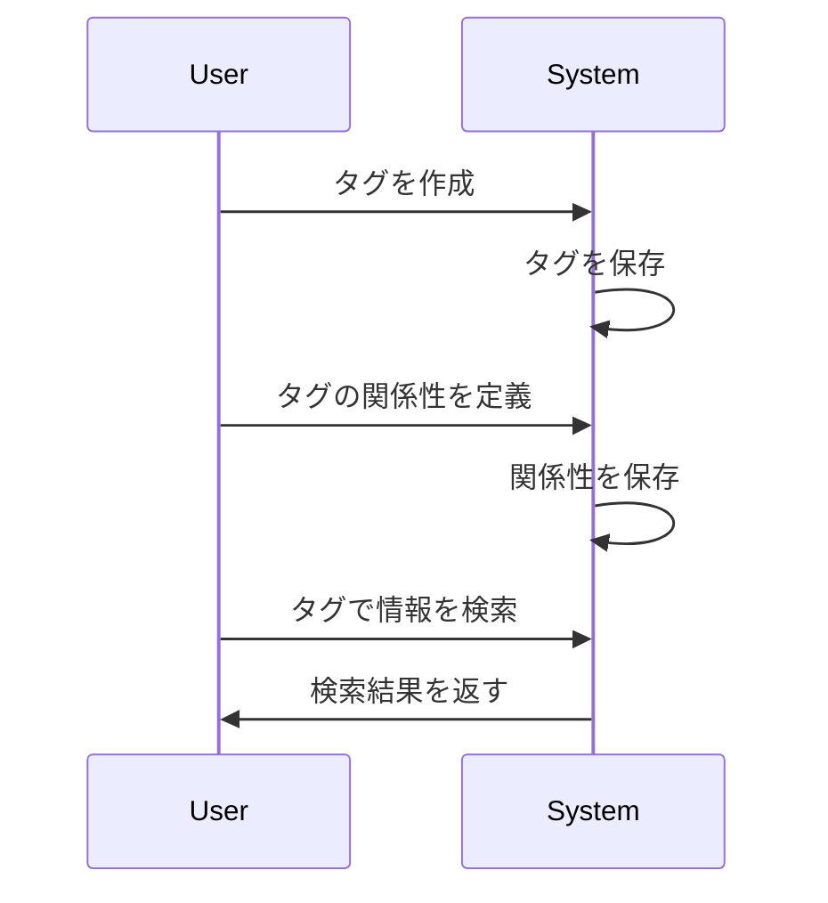

# タグ

## 概要
タグは、情報やデータを分類・整理するためのラベルです。このシステムでは、タグを用いて様々な情報を関連付け、効率的に管理することができます。

## なぜ重要か
タグを使用することで、情報の検索や整理が容易になり、ユーザーは必要なデータに迅速にアクセスできるようになります。また、タグ間の関係性を定義することで、より複雑な情報の構造を理解しやすくなります。

## 基本の流れ
1. **タグの作成**: ユーザーは新しいタグを作成し、特定の情報に関連付けます。
2. **タグの関係性の定義**: タグ同士の関係（包含関係や同値関係など）を定義します。
3. **情報の検索**: タグを使用して情報を検索し、必要なデータを取得します。

## 主要コンポーネント
- **タグID**: 各タグを一意に識別するためのID。
- **タグ名**: タグの表示名。
- **タグ情報**: タグに関連するメタデータ（例: 提案中かどうか、安定性など）。
- **タグ階層**: タグ間の関係性を示す階層構造。

## 外部/内部インターフェース
- **APIエンドポイント**: タグの作成、関係性の定義、情報の検索を行うためのAPI。
- **データベース**: タグ情報を保存するためのデータベース。

## 例（ユーザー視点のシナリオ）
1. ユーザーが「旅行」というタグを作成します。
2. ユーザーは「旅行」タグを「日本旅行」と「海外旅行」というサブタグに分けます。
3. ユーザーは「旅行」タグを使用して、関連する情報を検索し、必要なデータを取得します。

## 制約と既知の注意点
- タグ名は最大100文字までの制限があります。
- 同じタグ間の関係を評価することはできません（例: 自分自身を上位タグとして定義することはできない）。

## 用語集
- **タグ**: 情報を分類するためのラベル。
- **タグID**: タグを一意に識別するための識別子。
- **階層**: タグ間の関係性を示す構造。

## 関連ファイル
- `src/common/tag/mod.rs`
- `src/common/tag/hierarchy.rs`
- `src/common/tag/language_group.rs`
- `src/common/tag/non_top_tag.rs`
- `src/common/tag/proposal_operation.rs`
- `src/common/tag/redis_tag_info.rs`
- `src/common/tag/relation.rs`
- `src/common/tag/tag_id.rs`
- `src/common/tag/tag_info.rs`
- `src/common/tag/tag_name.rs`
- `src/common/tag/top_tag.rs`
- `src/endpoints/tag/list/mod.rs`
- `src/endpoints/tag/proposal/mod.rs`
- `src/endpoints/tag/proposal/propose/dsl/mod.rs`
- `src/endpoints/tag/proposal/propose/endpoint.rs`
- `src/endpoints/tag/proposal/propose/interpreter/mod.rs`
- `src/endpoints/tag/proposal/withdraw/mod.rs`
- `src/endpoints/tag/rating/get/mod.rs`
- `src/endpoints/tag/rating/rate/mod.rs`
- `src/endpoints/tag/rating/unrate/mod.rs`
- `src/endpoints/tag/search/mod.rs`