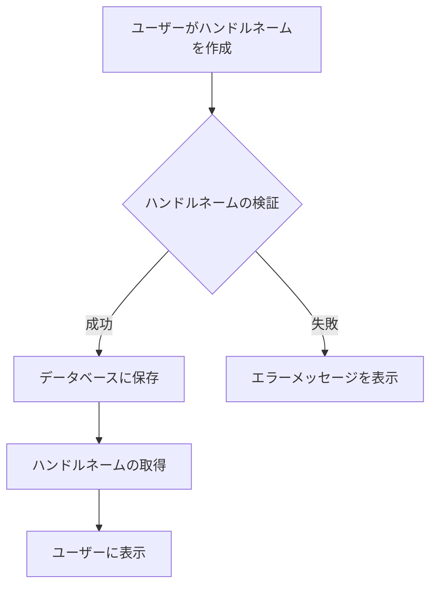

# ハンドルネーム
ハンドルネームは、ユーザーがオンラインでの活動やコミュニケーションに使用する仮名です。この名前は、個人の特定を避けつつ、他者とのやり取りを可能にします。

## 概要
ハンドルネームは、特にソーシャルメディアやオンラインフォーラムで使用されることが多く、ユーザーが匿名性を保ちながら自己表現を行う手段となります。このシステムでは、ハンドルネームを管理するためのデータ構造や操作が定義されています。

## なぜ重要か
ハンドルネームは、ユーザーが自分のアイデンティティを自由に表現できる場を提供します。また、個人情報を保護しつつ、コミュニティ内での交流を促進する役割も果たします。適切なハンドルネームの管理は、ユーザーエクスペリエンスを向上させるために不可欠です。

## 仕組みと基本の流れ
ハンドルネームは、ユーザーアカウントに関連付けられ、データベースに保存されます。ユーザーは新しいハンドルネームを作成したり、既存のものを変更したりできます。これらの操作は、APIを通じて行われ、データベースに対するCRUD（作成、読み取り、更新、削除）操作が実行されます。

### データ・状態・ルール
- **ハンドルネーム**: ユーザーが設定する名前。最大文字数は100文字で、特定の文字コスト制限があります[1]。
- **ハンドルID**: 各ハンドルネームに関連付けられた一意の識別子。UUID形式で生成されます[2]。
- **共有数**: 各ハンドルネームが他のユーザーにどれだけ共有されているかを示す数値です[3]。

### フローとアルゴリズム（必要なら Mermaid 図）
以下は、ハンドルネームの作成から取得までの基本的なフローを示します。

### 例外・コーナーケース・既知の落とし穴
- ハンドルネームが空の場合や、文字数が制限を超える場合はエラーが発生します[4]。
- 匿名名義（空のハンドルネーム）は削除できないため、注意が必要です[5]。

### 制約・前提・非機能要件
- ハンドルネームは最大100文字で、特定の文字コストを超えてはいけません[1]。
- データベースの操作は非同期で行われ、エラーハンドリングが必要です[6]。

## 利用シナリオ（ユーザー視点）
1. ユーザーが新しいアカウントを作成する際に、ハンドルネームを設定します。
2. 既存のハンドルネームを変更したい場合、ユーザーは新しい名前を入力し、システムがそれを検証します。
3. ユーザーは自分のハンドルネームを使用して、他のユーザーと交流します。

## 運用のヒント / ベストプラクティス（bad knowhow 可）
- ハンドルネームの変更は、ユーザーが混乱しないように慎重に行うべきです。変更履歴を保持することが推奨されます。
- ユーザーに対して、ハンドルネームの選択に関するガイドラインを提供することで、適切な名前を選ぶ手助けをします。

## 用語集
- **ハンドルネーム**: オンラインでのユーザーの仮名。
- **ハンドルID**: ハンドルネームに関連付けられた一意の識別子。
- **共有数**: ハンドルネームが他のユーザーにどれだけ共有されているかを示す数値。

## 関連ファイル
- [src/common/handle/id.rs](https://github.com/netmateapp/netmate-api/tree/main/src/common/handle/id.rs)
- [src/common/handle/name.rs](https://github.com/netmateapp/netmate-api/tree/main/src/common/handle/name.rs)
- [src/common/handle/share_count.rs](https://github.com/netmateapp/netmate-api/tree/main/src/common/handle/share_count.rs)
- [src/endpoints/handle/count/dsl.rs](https://github.com/netmateapp/netmate-api/tree/main/src/endpoints/handle/count/dsl.rs)
- [src/endpoints/handle/count/endpoint.rs](https://github.com/netmateapp/netmate-api/tree/main/src/endpoints/handle/count/endpoint.rs)
- [src/endpoints/handle/count/interpreter.rs](https://github.com/netmateapp/netmate-api/tree/main/src/endpoints/handle/count/interpreter.rs)
- [src/endpoints/handle/count/mod.rs](https://github.com/netmateapp/netmate-api/tree/main/src/endpoints/handle/count/mod.rs)
- [src/endpoints/handle/create/dsl.rs](https://github.com/netmateapp/netmate-api/tree/main/src/endpoints/handle/create/dsl.rs)
- [src/endpoints/handle/create/endpoint.rs](https://github.com/netmateapp/netmate-api/tree/main/src/endpoints/handle/create/endpoint.rs)
- [src/endpoints/handle/create/interpreter.rs](https://github.com/netmateapp/netmate-api/tree/main/src/endpoints/handle/create/interpreter.rs)
- [src/endpoints/handle/create/mod.rs](https://github.com/netmateapp/netmate-api/tree/main/src/endpoints/handle/create/mod.rs)
- [src/endpoints/handle/delete/dsl.rs](https://github.com/netmateapp/netmate-api/tree/main/src/endpoints/handle/delete/dsl.rs)
- [src/endpoints/handle/delete/endpoint.rs](https://github.com/netmateapp/netmate-api/tree/main/src/endpoints/handle/delete/endpoint.rs)
- [src/endpoints/handle/delete/interpreter.rs](https://github.com/netmateapp/netmate-api/tree/main/src/endpoints/handle/delete/interpreter.rs)
- [src/endpoints/handle/delete/mod.rs](https://github.com/netmateapp/netmate-api/tree/main/src/endpoints/handle/delete/mod.rs)
- [src/endpoints/handle/list/dsl.rs](https://github.com/netmateapp/netmate-api/tree/main/src/endpoints/handle/list/dsl.rs)
- [src/endpoints/handle/list/endpoint.rs](https://github.com/netmateapp/netmate-api/tree/main/src/endpoints/handle/list/endpoint.rs)
- [src/endpoints/handle/list/interpreter.rs](https://github.com/netmateapp/netmate-api/tree/main/src/endpoints/handle/list/interpreter.rs)
- [src/endpoints/handle/list/mod.rs](https://github.com/netmateapp/netmate-api/tree/main/src/endpoints/handle/list/mod.rs)
- [src/endpoints/handle/rename/dsl.rs](https://github.com/netmateapp/netmate-api/tree/main/src/endpoints/handle/rename/dsl.rs)
- [src/endpoints/handle/rename/endpoint.rs](https://github.com/netmateapp/netmate-api/tree/main/src/endpoints/handle/rename/endpoint.rs)
- [src/endpoints/handle/rename/interpreter.rs](https://github.com/netmateapp/netmate-api/tree/main/src/endpoints/handle/rename/interpreter.rs)
- [src/endpoints/handle/rename/mod.rs](https://github.com/netmateapp/netmate-api/tree/main/src/endpoints/handle/rename/mod.rs)

## 根拠注釈
[1]: [src/common/handle/name.rs](https://github.com/netmateapp/netmate-api/tree/main/src/common/handle/name.rs)  
[2]: [src/common/handle/id.rs](https://github.com/netmateapp/netmate-api/tree/main/src/common/handle/id.rs)  
[3]: [src/common/handle/share_count.rs](https://github.com/netmateapp/netmate-api/tree/main/src/common/handle/share_count.rs)  
[4]: [src/common/handle/name.rs](https://github.com/netmateapp/netmate-api/tree/main/src/common/handle/name.rs)  
[5]: [src/endpoints/handle/delete/dsl.rs](https://github.com/netmateapp/netmate-api/tree/main/src/endpoints/handle/delete/dsl.rs)  
[6]: [src/endpoints/handle/create/interpreter.rs](https://github.com/netmateapp/netmate-api/tree/main/src/endpoints/handle/create/interpreter.rs)