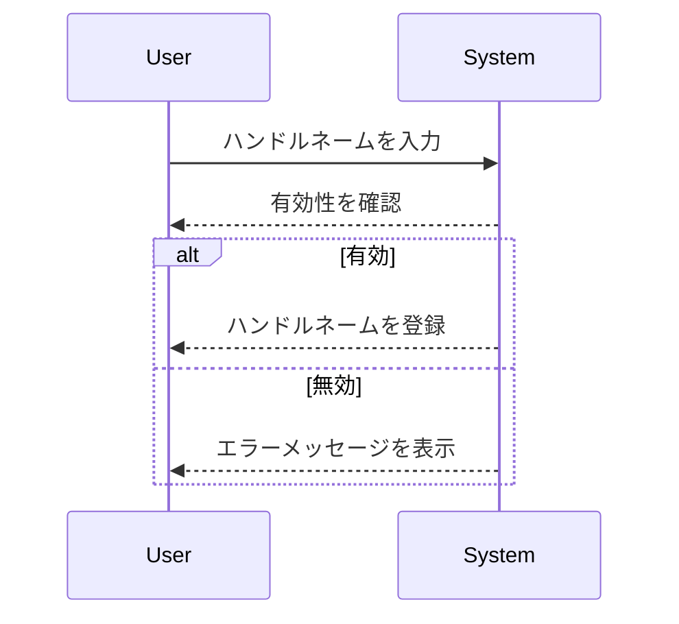

# ハンドルネーム

## 概要
ハンドルネームは、ユーザーがオンラインで自分を識別するための名前です。この名前は、個人のプライバシーを保護しつつ、他のユーザーとのコミュニケーションを円滑にするために重要です。

## なぜ重要か
ハンドルネームは、ユーザーのアイデンティティを形成し、コミュニティ内での認知度を高めます。また、他のユーザーと区別するための重要な要素であり、特にオンラインプラットフォームでは、個人情報を公開せずに交流する手段として機能します。

## 基本の流れ
1. ユーザーがハンドルネームを入力します。
2. システムがそのハンドルネームの有効性を確認します。
3. 有効な場合、ハンドルネームが登録されます。
4. 登録されたハンドルネームは、他のユーザーとのやり取りに使用されます。

## 主要コンポーネント
- **ハンドルネームのバリデーション**: 入力されたハンドルネームが空でないか、文字数制限を超えていないかを確認します。
- **ハンドルネームの登録**: 有効なハンドルネームをデータベースに保存します。
- **ハンドルネームの管理**: ハンドルネームの変更や削除を行うための機能を提供します。

## 外部/内部インターフェース
- **外部インターフェース**: ユーザーがハンドルネームを入力するためのフォーム。
- **内部インターフェース**: バリデーションや登録処理を行うAPIエンドポイント。

## 例（ユーザー視点のシナリオ）
1. ユーザーが「@example_user」というハンドルネームを入力します。
2. システムがそのハンドルネームが空でないこと、文字数が適切であることを確認します。
3. 問題がなければ、「@example_user」が正常に登録され、他のユーザーと交流できるようになります。

## 制約と既知の注意点
- ハンドルネームは最大100文字までとし、特定の文字数制限があります。
- 空のハンドルネームは許可されていません。
- 特殊文字や不適切な内容を含むハンドルネームは登録できません。

## 用語集
- **ハンドルネーム**: オンラインでのユーザーの識別名。
- **バリデーション**: 入力されたデータが正しいかどうかを確認するプロセス。

## 関連ファイル
- `src/common/handle/name.rs`
- `src/endpoints/handle/create/mod.rs`
- `src/endpoints/handle/delete/mod.rs`
- `src/endpoints/handle/rename/mod.rs`
- `src/endpoints/handle/list/mod.rs`
- `src/endpoints/handle/count/mod.rs`