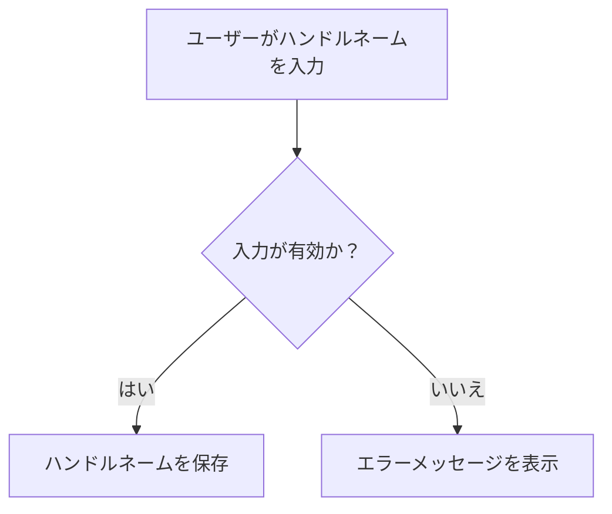

# ハンドルネーム
ハンドルネームは、ユーザーがオンラインで使用するニックネームや識別子です。これにより、ユーザーは匿名性を保ちながら他者とコミュニケーションを取ることができます。

## 概要
ハンドルネームは、特にソーシャルメディアやオンラインフォーラムで一般的に使用される概念です。ユーザーは自分の本名を明かさずに、個性を表現したり、他のユーザーと交流したりするためにハンドルネームを選びます。

## なぜ重要か
ハンドルネームは、ユーザーのプライバシーを保護するだけでなく、個々のアイデンティティを形成する重要な要素です。特にオンライン環境では、匿名性がユーザーの自由な表現を促進し、安心して参加できる場を提供します。

## 仕組みと基本の流れ
ハンドルネームは、ユーザーがアカウントを作成する際に設定されます。システムは、ハンドルネームの有効性を確認し、必要に応じて制約を適用します。ユーザーは後からハンドルネームを変更することも可能ですが、特定の条件が満たされている必要があります。

## 仕様・特徴（詳細）
### データ・状態・ルール
- **ハンドルネームの最大文字数**: 100文字まで許可されます。この制約は、特にCJK（中国語、日本語、韓国語）文字を考慮して設定されています[1]。
- **ハンドルネームの形式**: 空文字は許可されず、特定の文字数を超える場合はエラーが発生します[2]。

### フローとアルゴリズム（必要なら Mermaid 図）
以下のフローは、ハンドルネームの作成と検証のプロセスを示しています。

### 例外・コーナーケース・既知の落とし穴
- **空文字**: ハンドルネームとして空文字を入力した場合、エラーが発生します[3]。
- **文字数制限**: 設定された文字数を超えるハンドルネームは受け付けられません[4]。

### 制約・前提・非機能要件
- ハンドルネームは一意である必要があります。すでに使用されているハンドルネームを再利用することはできません。
- システムは、ハンドルネームの変更を行う際に、特定の条件（例えば、一定の時間が経過していること）を満たす必要があります。

## 利用シナリオ（ユーザー視点）
ユーザーは、アカウント作成時に自分の好きなハンドルネームを選びます。このハンドルネームは、他のユーザーとのコミュニケーションやプロフィール表示に使用されます。ユーザーは、必要に応じてハンドルネームを変更することもできますが、変更には制約があることを理解しておく必要があります。

## 運用のヒント / ベストプラクティス（bad knowhow 可）
- ハンドルネームを選ぶ際は、他のユーザーにとって覚えやすく、かつ自分の個性を反映したものを選ぶと良いでしょう。
- ハンドルネームの変更は慎重に行い、変更後は他のユーザーに通知することをお勧めします。

## 用語集（本文と対応づけて）
- **ハンドルネーム**: オンラインで使用されるニックネームや識別子。
- **CJK**: 中国語、日本語、韓国語の文字を含む言語群。

## 関連ファイル
- [src/common/handle/id.rs](https://github.com/netmateapp/netmate-api/tree/main/src/common/handle/id.rs)
- [src/common/handle/name.rs](https://github.com/netmateapp/netmate-api/tree/main/src/common/handle/name.rs)
- [src/common/handle/share_count.rs](https://github.com/netmateapp/netmate-api/tree/main/src/common/handle/share_count.rs)
- [src/endpoints/handle/count/dsl.rs](https://github.com/netmateapp/netmate-api/tree/main/src/endpoints/handle/count/dsl.rs)
- [src/endpoints/handle/count/endpoint.rs](https://github.com/netmateapp/netmate-api/tree/main/src/endpoints/handle/count/endpoint.rs)
- [src/endpoints/handle/count/interpreter.rs](https://github.com/netmateapp/netmate-api/tree/main/src/endpoints/handle/count/interpreter.rs)
- [src/endpoints/handle/count/mod.rs](https://github.com/netmateapp/netmate-api/tree/main/src/endpoints/handle/count/mod.rs)
- [src/endpoints/handle/create/dsl.rs](https://github.com/netmateapp/netmate-api/tree/main/src/endpoints/handle/create/dsl.rs)
- [src/endpoints/handle/create/endpoint.rs](https://github.com/netmateapp/netmate-api/tree/main/src/endpoints/handle/create/endpoint.rs)
- [src/endpoints/handle/create/interpreter.rs](https://github.com/netmateapp/netmate-api/tree/main/src/endpoints/handle/create/interpreter.rs)
- [src/endpoints/handle/create/mod.rs](https://github.com/netmateapp/netmate-api/tree/main/src/endpoints/handle/create/mod.rs)
- [src/endpoints/handle/delete/dsl.rs](https://github.com/netmateapp/netmate-api/tree/main/src/endpoints/handle/delete/dsl.rs)
- [src/endpoints/handle/delete/endpoint.rs](https://github.com/netmateapp/netmate-api/tree/main/src/endpoints/handle/delete/endpoint.rs)
- [src/endpoints/handle/delete/interpreter.rs](https://github.com/netmateapp/netmate-api/tree/main/src/endpoints/handle/delete/interpreter.rs)
- [src/endpoints/handle/delete/mod.rs](https://github.com/netmateapp/netmate-api/tree/main/src/endpoints/handle/delete/mod.rs)
- [src/endpoints/handle/list/dsl.rs](https://github.com/netmateapp/netmate-api/tree/main/src/endpoints/handle/list/dsl.rs)
- [src/endpoints/handle/list/endpoint.rs](https://github.com/netmateapp/netmate-api/tree/main/src/endpoints/handle/list/endpoint.rs)
- [src/endpoints/handle/list/interpreter.rs](https://github.com/netmateapp/netmate-api/tree/main/src/endpoints/handle/list/interpreter.rs)
- [src/endpoints/handle/list/mod.rs](https://github.com/netmateapp/netmate-api/tree/main/src/endpoints/handle/list/mod.rs)
- [src/endpoints/handle/rename/dsl.rs](https://github.com/netmateapp/netmate-api/tree/main/src/endpoints/handle/rename/dsl.rs)
- [src/endpoints/handle/rename/endpoint.rs](https://github.com/netmateapp/netmate-api/tree/main/src/endpoints/handle/rename/endpoint.rs)
- [src/endpoints/handle/rename/interpreter.rs](https://github.com/netmateapp/netmate-api/tree/main/src/endpoints/handle/rename/interpreter.rs)
- [src/endpoints/handle/rename/mod.rs](https://github.com/netmateapp/netmate-api/tree/main/src/endpoints/handle/rename/mod.rs)

## 根拠注釈
[1]: [src/common/handle/name.rs](https://github.com/netmateapp/netmate-api/tree/main/src/common/handle/name.rs)  
[2]: [src/common/handle/name.rs](https://github.com/netmateapp/netmate-api/tree/main/src/common/handle/name.rs)  
[3]: [src/common/handle/name.rs](https://github.com/netmateapp/netmate-api/tree/main/src/common/handle/name.rs)  
[4]: [src/common/handle/name.rs](https://github.com/netmateapp/netmate-api/tree/main/src/common/handle/name.rs)