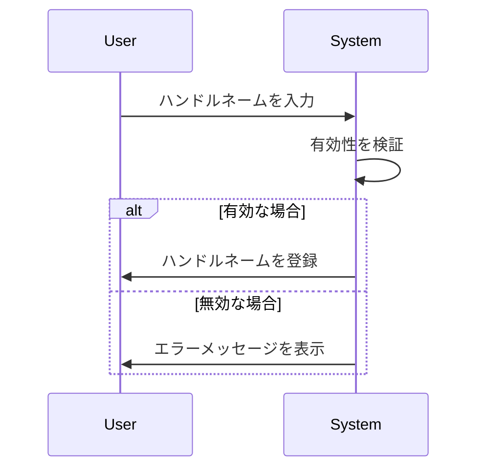

# ハンドルネーム

## 概要
ハンドルネームは、ユーザーがオンラインでのアイデンティティを表現するための名前です。この名前は、特にフォーラムやソーシャルメディアなどのプラットフォームで使用されます。ハンドルネームは、ユーザーが自分自身を特定するための重要な要素であり、他のユーザーとのコミュニケーションを円滑にする役割を果たします。

## なぜ重要か
ハンドルネームは、ユーザーが自分の個性や興味を反映させる手段です。適切なハンドルネームを選ぶことで、他のユーザーとの関係を築きやすくなり、コミュニティ内での認知度を高めることができます。また、プライバシーを保護するためにも、実名ではなくハンドルネームを使用することが一般的です。

## 基本の流れ
1. ユーザーがハンドルネームを作成する。
2. システムがハンドルネームの有効性を検証する（空でないか、文字数が適切かなど）。
3. 有効なハンドルネームが登録され、ユーザーのプロフィールに関連付けられる。
4. ユーザーはこのハンドルネームを使用して他のユーザーと交流する。

## 主要コンポーネント
- **HandleId**: ハンドルネームを一意に識別するためのID。UUIDを使用して生成されます。
- **HandleName**: ユーザーが入力するハンドルネームそのもの。文字数制限や空文字のチェックが行われます。

## 外部/内部インターフェース
- **作成エンドポイント**: 新しいハンドルネームを作成するためのAPI。
- **削除エンドポイント**: 既存のハンドルネームを削除するためのAPI。
- **リストエンドポイント**: 登録されているハンドルネームの一覧を取得するためのAPI。
- **リネームエンドポイント**: 既存のハンドルネームを変更するためのAPI。

## 例（ユーザー視点のシナリオ）
1. ユーザーが「CoolCat」というハンドルネームを入力します。
2. システムが「CoolCat」が空でなく、文字数制限を満たしているかを確認します。
3. 問題がなければ、「CoolCat」がユーザーのプロフィールに登録され、他のユーザーと交流する際に使用されます。

## 制約と既知の注意点
- ハンドルネームは空であってはならず、最大文字数を超えてはいけません。
- 特殊文字や不適切な言葉を含むハンドルネームは拒否される可能性があります。

## 用語集
- **ハンドルネーム**: オンラインでのユーザー名やニックネーム。
- **UUID**: Universally Unique Identifierの略で、一意の識別子を生成するための標準。

## 関連ファイル
- `src/common/handle/id.rs`
- `src/common/handle/name.rs`
- `src/endpoints/handle/create/mod.rs`
- `src/endpoints/handle/delete/mod.rs`
- `src/endpoints/handle/list/mod.rs`
- `src/endpoints/handle/rename/mod.rs`