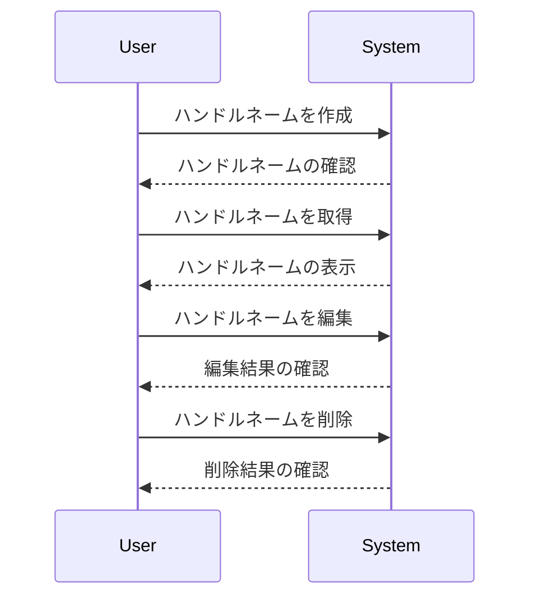

# ハンドルネーム

## 概要
ハンドルネームは、ユーザーがオンラインでのアイデンティティを表現するための名前です。このシステムでは、ユーザーが独自のハンドルネームを作成し、管理することができます。ハンドルネームは、ユーザーのアカウントに関連付けられ、他のユーザーとのインタラクションに使用されます。

## なぜ重要か
ハンドルネームは、ユーザーがオンラインで自分を表現する重要な要素です。適切なハンドルネームを持つことで、ユーザーは他のユーザーと簡単に識別され、コミュニケーションが円滑になります。また、ハンドルネームの管理機能は、ユーザーが自分のアイデンティティをコントロールできるようにするため、プライバシーやセキュリティの観点からも重要です。

## 基本の流れ
1. **ハンドルネームの作成**: ユーザーは新しいハンドルネームを作成し、アカウントに関連付けます。
2. **ハンドルネームの取得**: ユーザーは自分のハンドルネームや他のユーザーのハンドルネームを取得できます。
3. **ハンドルネームの編集**: ユーザーは既存のハンドルネームを変更できますが、特定の条件（匿名名義の削除など）に従う必要があります。
4. **ハンドルネームの削除**: ユーザーはハンドルネームを削除することができますが、匿名名義は削除できません。

## 主要コンポーネント
- **HandleId**: ハンドルネームを一意に識別するためのID。
- **HandleName**: ユーザーが設定するハンドルネームの文字列。
- **HandleShareCount**: ハンドルネームが他のユーザーにどれだけ共有されたかを示すカウント。

## 外部/内部インターフェース
- **APIエンドポイント**:
  - `POST /handles`: 新しいハンドルネームを作成。
  - `GET /handles`: ユーザーのハンドルネームをリスト表示。
  - `PATCH /handles`: ハンドルネームを編集。
  - `DELETE /handles/:id`: ハンドルネームを削除。

## 例（ユーザー視点のシナリオ）
1. ユーザーは「CoolCat」というハンドルネームを作成します。
2. 他のユーザーが「CoolCat」を検索し、見つけます。
3. ユーザーは「CoolCat」を「AwesomeCat」に変更します。
4. ユーザーは「AwesomeCat」を削除しようとしますが、条件により削除できないことを知ります。

## 制約と既知の注意点
- ハンドルネームは最大100文字までとし、特定の文字コスト制限があります。
- 匿名名義は削除できません。
- ハンドルネームの変更は、他のユーザーとの識別に影響を与える可能性があります。

## 用語集
- **ハンドルネーム**: ユーザーがオンラインで使用する名前。
- **HandleId**: ハンドルネームを一意に識別するためのID。
- **HandleShareCount**: ハンドルネームが他のユーザーにどれだけ共有されたかを示すカウント。

## 関連ファイル
- `src/common/handle/id.rs`
- `src/common/handle/name.rs`
- `src/common/handle/share_count.rs`
- `src/endpoints/handle/create/dsl.rs`
- `src/endpoints/handle/create/endpoint.rs`
- `src/endpoints/handle/delete/dsl.rs`
- `src/endpoints/handle/delete/endpoint.rs`
- `src/endpoints/handle/list/dsl.rs`
- `src/endpoints/handle/list/endpoint.rs`
- `src/endpoints/handle/rename/dsl.rs`
- `src/endpoints/handle/rename/endpoint.rs`